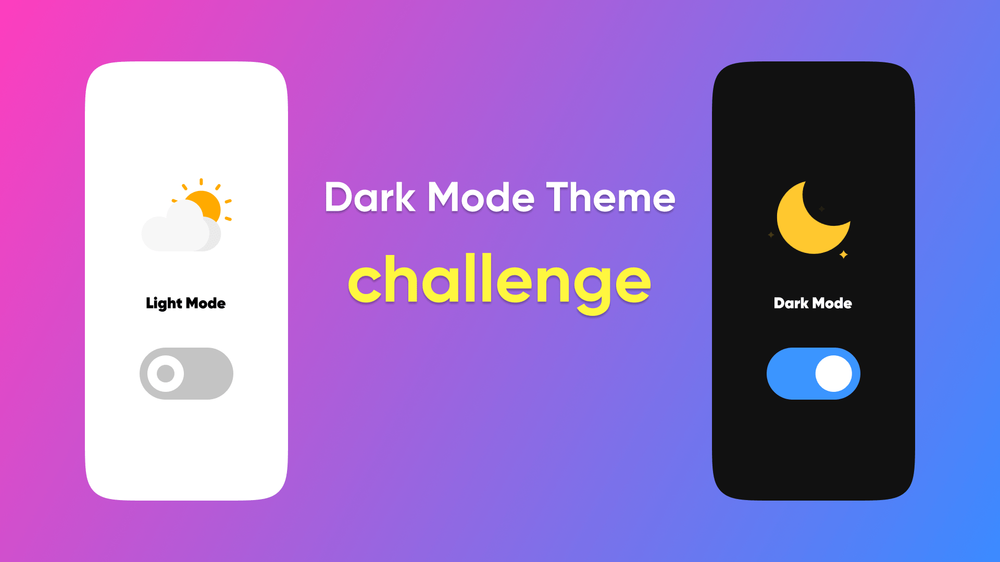

# Dark Mode Challenge

## Features

- Be able to toggle between a light and dark theme
- Be able to adjust the mode according to the theme settings in the browser
- Be able to save the mode in the browser and use it to determine the theme on subsequent visits
- Be able to choose the user's theme according to the clock (For example, if the time was between 9 pm and 6 am, the theme will be dark, otherwise the theme will be light)

## Takeaways

- CSS variable
- CSS media feature
- DOM Manipulation
- Local storage
- Date API
